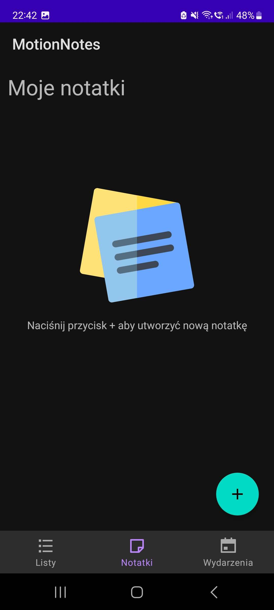

<h1> MotionNotes </h1>

A proof of concept Android application, meant to provide an alternative method of human-computer interaction.

This method is based on commands given by tilting/pushing the device in 3 axes (and 2 directions within them). This allows for partial control of the application without the need to touch the smartphone's screen. A 'demo' of this feature is shown in [Motion gestures](#motion-gestures) section.

This application is meant to be a combitaion of a digital notepad, journal and a diary. Users may store their entries in three predefined formats:
- lists (checklists)
- notes
- events

Each of them have specific features and should be used for different forms of information.

The neural network model used to recognize gestures can be found in the server repositoryu: [aleksgorecki/motion-server](https://github.com/aleksgorecki/motion-server).

The application's UI text is in Polish.
## Table of Contents

- [Table of Contents](#table-of-contents)
- [Features](#features)
  - [Content management](#content-management)
    - [Checklists](#checklists)
    - [Notes](#notes)
    - [Events](#events)
  - [Motion gestures](#motion-gestures)
    - [XPOS (XPOSITIVE) - Moving the phone to the right](#xpos-xpositive---moving-the-phone-to-the-right)
    - [XNEG (XNEGATIVE) - Moving the phone to the left](#xneg-xnegative---moving-the-phone-to-the-left)
    - [YPOSITIVE (YPOS) - Moving the phone up](#ypositive-ypos---moving-the-phone-up)
    - [YNEGATIVE (YNEG) - Moving the phone down](#ynegative-yneg---moving-the-phone-down)
    - [ZPOSITIVE (ZPOS) - Moving the phone towards oneself](#zpositive-zpos---moving-the-phone-towards-oneself)
    - [ZNEGATIVE (ZNEG) - Moving the phone away from oneself](#znegative-zneg---moving-the-phone-away-from-oneself)
- [Dependencies](#dependencies)

## Features

### Content management

The MotionNotes application provides all of the fundamental content management operations, such as:
- adding new entries
- editing existing entries
- deleting existing entries

These actions are performed with the use of floating action buttons, appearing in the bottom left corner of the screen. In the case of checklist management, additional buttons are added in order to gprovide control over indiviual items inside the list.

#### Checklists

Checklists are the most complex forms of entries.

A new list may be created using the "+" floating action button. Pressing this button transitions to the 'list creation/detail' view.

The topmost field is responsible for the name of the list. A list of current items in found below this field. A user can create new items, edit the existing ones, check/uncheck them and delete the selected ones.

Purple floating buttons are responsible for adding and deleting list items, and the teal ones are responsible for deleting or saving the entire checklist. List items are deleted by first selecting them, by clicking the trashcan icon, and then clicking the floating action button.

#### Notes

Notes are intented to store a long, unformatted string of text.

Notes are added and edited the same way as checklists, without the additional control od adding and removing elements.

#### Events

Events are intented to store information related to a specific time and date. They may be used as a reminder of upcoming events or as records in a journal.

Events are created and edited with the use of floating action buttons.
The event editing view consists of three fields:
- a name for the event entry
- date and time
- additional notes regarding the event  

 

### Motion gestures

The gestures act as 'commands' and allow for partial control of the applications interface. They may be used to navigated the available view and perform the same actions as floating action buttons. The supported gesture are the following:

#### XPOS (XPOSITIVE) - Moving the phone to the right
Used to navigate the bottom navigation (moves the current view to the next one on the right or loops back to the first one if outside of range). If a dialog window is shown, then it is used to click the rightmost button on it.

#### XNEG (XNEGATIVE) - Moving the phone to the left
Used to navigate the bottom navigation (moves the current view to the next one on the left or loops back to the last one if outside of range). If a dialog window is shown, then it is used to click the leftmost button on it.

#### YPOSITIVE (YPOS) - Moving the phone up
Used to create new entries and new list items, if inside a checklist edit view.

#### YNEGATIVE (YNEG) - Moving the phone down
Performs the same action as the smartphone's 'back' button.

#### ZPOSITIVE (ZPOS) - Moving the phone towards oneself
Saves the currently edited entry if inside an edit view.

#### ZNEGATIVE (ZNEG) - Moving the phone away from oneself
Deletes the currently edited entry if inside an edit view. If the user is in checklist edit view, and an item is selected for deletion, then this item takes priority and is deleted.

## Dependencies
- Tensorflow Lite
- EventBus (GreenRobot)